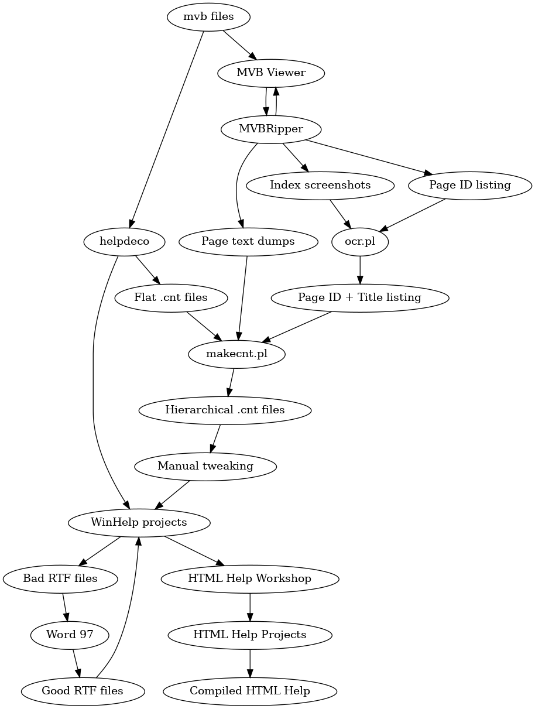

# mvb-extraction

This repository has the tools I've been writing for a (very cursed) pipeline to extract the content from the [September 1992 MSDN pre-release](https://archive.org/details/MSDN_September_1992), and possibly other things which use the Microsoft Multimedia Viewer.



## MMVRipper

This application runs on a Windows machine which has the MSDN viewer open and depending on compile-time flags, extracts any of the following:

- Screenshots of the text from the index for each topic/folder
- Text of each page, extracted using the "Copy" function
- Printouts of each page in PostScript including embedded styling, images, etc.

Additionally, a tree of internal page IDs will be written to standard output which should be redirected to a file as the program runs in the following format:

```
65536
  65537
  65793
  66049
  66305
  66561
65792
  66817
    65538
    65794
...
```

Everything else will be written to MMVRipper's working directory, named based on the internal ID.

A short video shows MMVRipper in operation here: [https://www.youtube.com/watch?v=Gl5cNOasZGM](https://www.youtube.com/watch?v=Gl5cNOasZGM).

### Notes for screen capture

The screenshots of the index entries are OCR and used to help reconstruct the original topic hierarchy. For best performance, I recommend forcing the system font to "Verdana" (by adding `MS Sans Serif=Verdana` into `WIN.INI`), setting the display DPI to 250% and the screen resolution to at least 1024x768, with the index window taking up the full width.

### Notes for print capture

The page printouts are captured by MMVRipper pretending to be a network printer and requires some manual setup.

1. Install the [HP Standard Port Monitor for Windows 95/98](https://archive.org/details/hpspm98_202310).
2. Install the [Adobe PostScript Printer Driver](https://archive.org/details/winsteng).
3. Set up a printer using the generic Adobe PostScript driver and a "raw" TCP/IP printer port pointing to 127.0.0.1
4. Set the above printer as the default printer.

Once that is done, MMVRipper's emulated printer will receive each print from the viewer application and the PostScript will be saved to disk.

## ocr.pl

This script performs OCR on the screenshots of the index captured by the MMVRipper program and produces a hierarchical listing of titles within a Microsoft Multimedia Viewer index.

## makecnt.pl

This script takes the tree listing produced by ocr.pl, the page text dumps from MMVRipper and a flat .cnt file produced by running helpdeco on a .mvb file and attempts to reproduce the original hierarchy in a new .cnt file.
